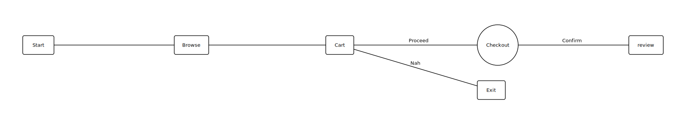

# Etched

A domain-specific language and compiler for describing directed graphs as structured text, with automatic layout and SVG rendering.

## What it does

Write your graph in a clean, readable syntax. Etched tokenizes and parses your source into an AST, runs a topological sort to determine node ordering, computes a layered grid layout, and emits an SVG file ready to use anywhere.


## Syntax

A graph has a name, a set of node declarations, and a set of edge statements.

```
graph "Order Processing" {
    node start "Start"
    node browse "Browse"
    node cart "Cart"
    node checkout {
        title: "Checkout"
        style {
        shape: circle
        fill: true
        color: "blue"
        }
    }

    node exit {
        title: "Exit"
        style {
        shape: square
        fill: true
        color: "purple"
        }
    }

    start -> browse -> cart
    cart -> "Proceed" -> checkout -> "Confirm" -> review
    cart -> "Nah" -> exit
}
```

**Node declarations** define a node's title and optional style. A simple node takes a string literal as its title. An expanded node uses a block with `title` and `style` fields.

**Edge statements** describe connections between nodes. Edges can be bare (`a -> b`) or labeled (`a -> "label" -> b`), and can form chains of any length.

## Building

Requires a C++23 compiler and CMake 3.5 or later.

```bash
cmake -B build
cmake --build build
```

## Usage

```bash
./Etched <input_file>
```

## Status

The compiler pipeline (tokenizing, parsing, and layout) is complete. SVG emission is in progress.
